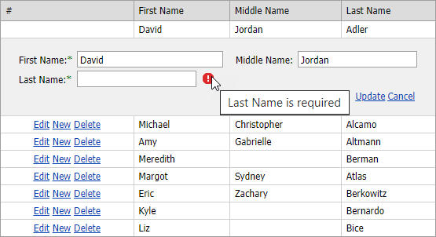

<!-- default badges list -->

<!-- default badges end -->
# GridView for ASP.NET MVC - How to bind the extension to a list and allow edit operations
<!-- run online -->
**[[Run Online]](https://codecentral.devexpress.com/128550026/)**
<!-- run online end -->

This example demonstrates how to bind the [GridView extension](https://docs.devexpress.com/AspNetMvc/8966/components/grid-view) to a list and allow users to edit extension data.

## Files to Review

* [GridViewEditingPartial.cshtml](./CS/Sample/Views/Home/GridViewEditingPartial.cshtml)
* [Index.cshtml](./CS/Sample/Views/Home/Index.cshtml)
* [HomeController.cs](./CS/Sample/Controllers/HomeController.cs)
* [Person.cs](./CS/Sample/Models/Person.cs)
* [PersonsList.cs](./CS/Sample/Models/PersonsList.cs)

## Documentation

* [Edit Data](https://docs.devexpress.com/AspNetMvc/16140/components/grid-view/data-editing-and-validation/data-editing)
* [Validate Data](https://docs.devexpress.com/AspNetMvc/16141/components/grid-view/data-editing-and-validation/validate-data)

## More Examples

* [Grid View for ASP.NET MVC - How to Bind a Grid to Standard In-Memory Data Sources (DataTable, List)](https://github.com/DevExpress-Examples/mvc-gridview-bind-to-in-memory-data-sources)
* [Grid View for ASP.NET MVC - How to Specify a Custom Edit Form Template](https://github.com/DevExpress-Examples/asp-net-mvc-grid-specify-custom-editform-template)
